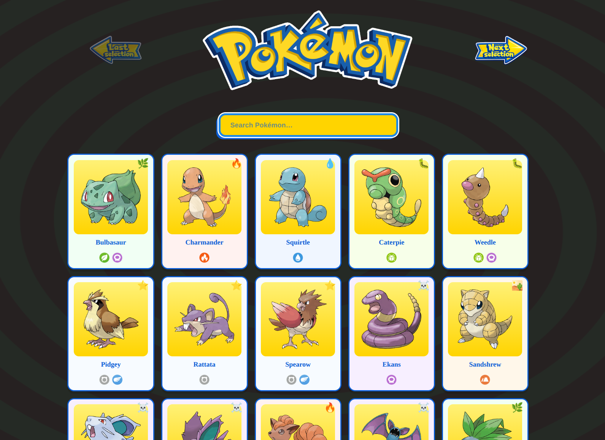

# Pokémon Card Display – API-driven Frontend Application

A JavaScript web application that displays Pokémon cards using the public PokéAPI.

The project focuses on building a clean frontend architecture with clear separation between **data handling, rendering, and styling**.

---

## Live Demo

👉 https://pokemon.quirinpflaum.ch/

---

## Screenshot

---

## Features

### Core Features

* paginated Pokémon card display (20 per page)
* dynamic API data fetching
* responsive grid layout
* clean card design with type-based styling
* stable pagination based on a local index file

---

### Dialog System

* interactive detail dialog for each Pokémon
* tab-based navigation:

  * **Types**
  * **Stats**
  * **Evolution**

---

### UX & Interaction

* dialog navigation via next / previous controls
* loading overlay for async operations
* autocomplete search with suggestions
* keyboard-friendly interaction (tabs, dialog navigation)

---

### Type System (API-based)

* Pokémon types rendered visually (icons + labels)
* dynamic type-based card styling using `data-type`
* API-driven type matchups:

  * **Strong Against**
  * **Weak Against**
* separation of UI and logic via attribute-based CSS

---

## Technologies

* JavaScript (ES6)
* HTML
* CSS
* REST API (PokéAPI)

---

## What I learned

This project helped me practice:

* working with REST APIs and multiple endpoints
* building a structured frontend architecture
* separating controller logic from rendering
* using `data-*` attributes to connect JS and CSS
* implementing async data flows (`fetch`, `await`)
* designing scalable UI systems
* managing UI state in a predictable way
* building UI systems that scale beyond simple DOM manipulation

---

## Architecture Highlights

* strict separation of concerns (controller / renderer / styling)
* render layer is fully decoupled from data fetching
* UI driven by state, not direct DOM manipulation
* reusable rendering functions

---

## Project Architecture

### index.html

Static layout and containers for the Pokémon cards and dialog.

---

### css/

Pure styling layer.

* reacts to UI state via `data-*` attributes
* type-based styling handled through CSS variables (`--type-*`)
* layout built using Grid and Flexbox

---

### js/main.js

Main controller logic.

Responsible for:

* pagination state
* API requests
* dialog orchestration
* type data fetching

`pokeCount` acts as the **single source of truth** for pagination.

---

### js/render.js

Pure rendering layer.

* no API logic
* no state management
* builds cards and dialog UI
* receives fully prepared data

---

### json/base_names.json

Local index file used for stable pagination.

Prevents UI logic from depending on API availability.

---

### scripts/

Python helper scripts used to generate or analyze JSON data.

These are **development tools only**, not part of runtime.

---

## Design Decisions

* single pagination state (`pokeCount`)
* strict separation of concerns:

  * controller (data)
  * renderer (UI)
  * CSS (visual logic)
* attribute-driven styling instead of JS-based styling
* API data is transformed before rendering
* failed API requests are skipped (skip & continue)
* focus on maintainability over feature complexity

---

## Future Improvements

This project intentionally avoids overengineering and documents future extensions instead.

### Planned Enhancements

* full **dual-type matchup calculation**
* dedicated **About tab** (species, abilities, height, weight)
* optional **Moves tab** (curated or enriched move data)
* caching for API requests (type, species, moves)

See:
`docs/dialog-expansion-roadmap.md`

---

## Data Source

PokéAPI
https://pokeapi.co

---

## Note

This project prioritizes:

* clean architecture
* understandable code structure
* incremental feature development

Advanced features are intentionally documented and postponed to allow focused iteration and future expansion.
